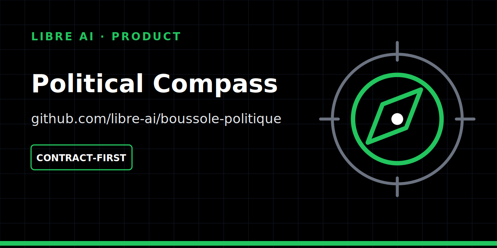

<p align="center">
  
</p>

# Boussole Politique

> **Compare tes positions aux votes, sans étiquette.**

Boussole Politique est une application civique local-first en cours de construction. Elle présente des énoncés parlementaires sans étiquette politique, permet de se positionner localement, puis compare ces positions aux votes publics des élus et des groupes.

La formulation méthodologique canonique est :

> **A voté comme toi sur les énoncés que tu as jugés.**

## Statut

Le projet est un prototype méthodologique et technique. Il ne constitue ni une application électorale, ni une consigne de vote, ni un classement des élus, ni un score de confiance morale.

Le vivier Q8 est viable en volume, mais sa symétrie politique et sa couverture thématique ne sont pas encore démontrées. La gate M1 reste donc `conditional` et interdit une sélection canonique : 95 candidats cœur ont un lien source fort, dont 84 scrutins adoptés contre 11 rejetés. La sélection VAA reste le risque méthodologique principal et nécessite une revue indépendante.

## Principes

- aucune position politique individuelle ne quitte l’appareil par défaut ;
- aucun compte, aucune télémétrie, aucun push et aucun LLM dans le MVP ;
- abstentions et non-votes exclus du score et affichés séparément ;
- aucun score sans `n` ni dénominateur ;
- groupe politique pris au moment du vote ;
- faits exhaustifs dans leur périmètre, sélection VAA curatée et versionnée ;
- aucun palmarès national.

## État du dépôt

- spécification v1 et architecture cible dans `docs/` ;
- dry-run reproductible sur les données AN des législatures 16 et 17 ;
- identité visuelle provisoire et pipeline déterministe dans `assets/brand/` et `scripts/generate-assets.sh` ;
- contrats Rust purs dans `crates/domain` et `crates/scoring` ;
- aucun shell Dioxus métier ni serveur axum à ce stade.

Les contrats Rust sont vérifiés avec la toolchain verrouillée `1.85.1`, en natif et pour `wasm32-unknown-unknown`. La CI exécute également deux générations successives des assets pour contrôler leur déterminisme. Voir `docs/implementation/contrats-rust-m2.md`.

## Contrôles

```sh
./scripts/generate-assets.sh
python3 scripts/test-assets.py
./scripts/check-rust.sh
python3 scripts/verify-m1-sensitivity.py
```

Le dernier script requiert la toolchain définie dans `rust-toolchain.toml`, avec la cible `wasm32-unknown-unknown`.

## Documentation centrale

- `docs/spec-v1.md`
- `docs/architecture-cible.md`
- `docs/charte-neutralite.md`
- `docs/methodology/selection-v1.md`
- `modele-donnees-v2.md`
- `formule-congruence.md`
- `roadmap.md`

## Données

Les archives officielles nécessaires au dry-run sont conservées dans `dry-run/data/*.zip`. Leurs répertoires extraits locaux sont ignorés par Git afin d’éviter environ 370 Mio de duplication.

Les cinq overrides budgétaires de `dry-run/fixtures/vivier-link-overrides.json` sont encore proposés pour relecture croisée et ne sont pas canoniques.

## Licence

Code et assets originaux : MIT, voir `LICENSE` et `assets/brand/LICENSE.md`. Les données sources conservent leurs licences et conditions propres. Le nom public et les usages de marque restent soumis à revue juridique.
